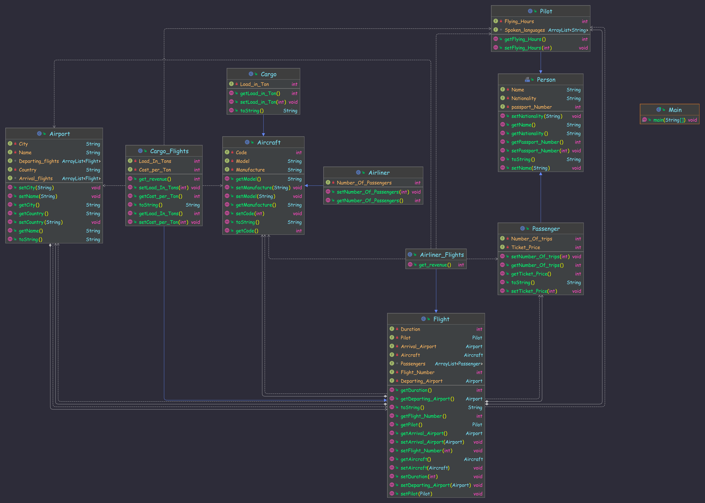

# JF_System
Jordan Flights (JF): is a flight managing firm. They want to develop a system for flight management. You are currently working as the system architect at JF and you have been asked to manage this project. After many interviews and meetings with different employees and customers, you received the following description about the system:

Flights are objects that represent the trip from place to another place through airports.
The most basic information about Airports are: (name, city, country, list of departing fights, list of arrival flights). Each flight has flight number, a duration, departing airport, arrival airport, list of passengers, pilot, aircraft.

Aircrafts have model, manufacturer and code but also they come in two types: Airliner and Cargo. Airliner is used to transport passengers and has number of passengers property while Cargo is used to transport goods and has load (in tons) property. All Aircrafts have functionality to calculate the fuel consumption based on its type. 			

Flights has two types also CargoFlights and PassengerFlights. CargoFlights add load of the flight in tons and the cost per ton. PassengerFlights add the list of passengers. All flights must have functionality to calculate the revenue of the flight based on the following table:

CargoFlights:
Load(Tons)*CostPerTon

PassengerFlights:
The summation of the ticket price of all passengers of the flight

Pilots and Passengers are persons, Persons have name, nationality and passport number. Each Passenger has the number of travelled KM and the ticket price. Pilots stores the flying hours and a list of spoken languages.
Note: Flights and Aircrafts are too general.
It has been decided to use an object oriented approach to design and implement the system
